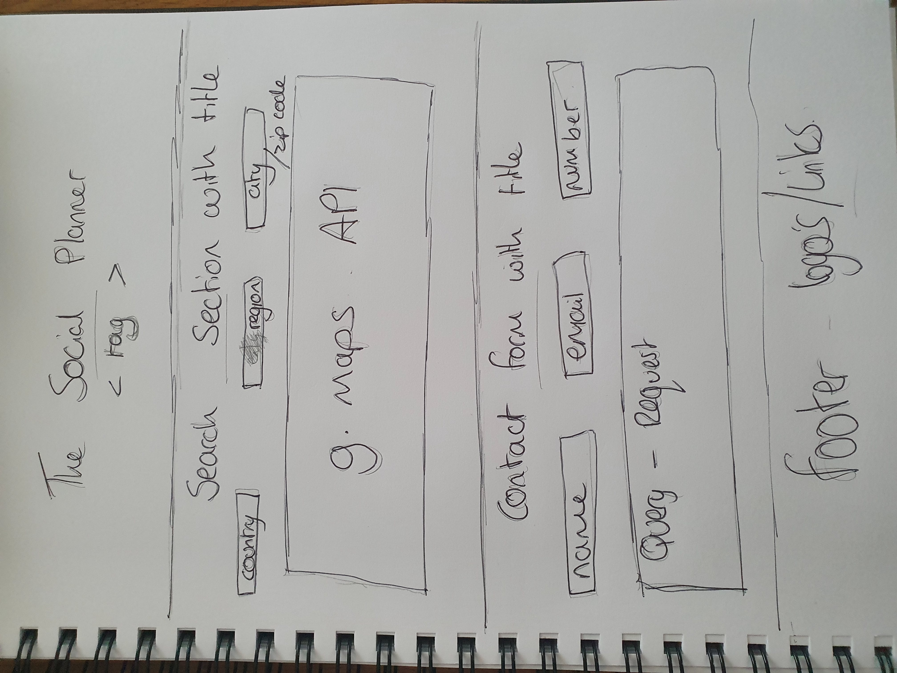

The Social Planner is a one-page website application, designed to search for Bars and Restaurants in major cities around the world.

# UX
The purpose of the site is to provide a search of Restaurants and Bars on a global scale, dependent on the city selected.

### User Stories
A family has booked a trip in the summer. The parents would like to see what dining options they have close to where they are staying. They use the social planner to find restaurants in their vacinity.

A businessman is welcoming colleagues over from a neighbouring country and would like to "show them his city", so uses the social planner to plan where to take his colleagues during their stay.

A woman is booking a hen party and looking to do a bar crawl, so searches her destination using the search fields to check the bars close to their lodging.

A couple are booking a city break, but the man is gluten free. They are unable to find many gluten free accomodating restaurants so decide to ask for assistance. Using the enquiry template, they reach out to the team at the social planner.

# Features
## Existing Features 
### Search fields
The search fields consist of a list of countries, and once a country is selected, the cities dropdown list populates with cities from that country.
### Google Maps Window
When a city is selected, the Google Maps window will zoom into the selected area and display restaurants and bars within a 5 km radius.
### Footer
The footer consists of social pages for the user to follow and keep up to date with the latest news fro the Social planner team.

# Technologies Used
### HTML5 (Hyper Text Markup Language)
Used to build the pages of this website. For more information on this language; https://en.wikipedia.org/wiki/HTML5
### CSS3 (Cascading Style Sheets):
I used this language to style my HTML5 pages through alignment, spacing and colour scheme. For more information on this language; https://en.wikipedia.org/wiki/Cascading_Style_Sheets
### JavaScript & jQuery
Javascript was used to integrate the Search Bars, Google Maps and Enquiry Email features; https://www.w3schools.com/js/ , https://api.jquery.com/
### JSON
JSON files were used to store the data for the countries and cities. https://en.wikipedia.org/wiki/JSON
### Google Maps API
The Google Maps API was used to visually show the nearby restaurants and bars to the user. https://developers.google.com/maps/documentation/javascript/tutorial
### EmailJS
After creating the form, i connected it to EmailJS, so it has a direct link to an email address when the form is filled and sent. https://www.emailjs.com/
### Bootstrap
This is a CSS framework that assists the developer in creating mobile responsive front-end projects. https://getbootstrap.com/
### Chrome Developer Tools
Web developer tools integrated in Google Chrome. Used to inspect the site on various mobile devices. For more information; https://developers.google.com/web/tools/chrome-devtools
### GitPod
An online IDE in which the HTML5 and CSS3 code was created and tested. https://gitpod.io
### GitHub
A website which works with GitPod, it provides hosting for software development version control using Git. https://github.com/
### W3C Code Validation
This was used to validate the HTML5 and CSS3, which notifies you of any errors. https://validator.w3.org/
### Beautifier.io
An online services which assists in beautifying and formatting your code to look elegant & professional. https://beautifier.io/

# Testing
### Javascript and jQuery
Throughout the process of development, various tests were carried out for the Search Bars and linking them to information, Google Maps and displaying the correct city and sending emails using emailjs.
To start, the application was desgined to search in 11 specific European countries, and 3 cities within each country. I tested how to link the Countries and Cities information, which started off using an array in the dropdown.js file, which countained the country names, however I felt it was not the right avenue to go down.
I researched online and found a site that explained how to link data from JSON files into a select menu. https://www.codebyamir.com/blog/populate-a-select-dropdown-list-with-json 
Using this information, I was able to link the countries into the select menu box and from there the correct cities into the second select box.

### Wireframes
  
-I created hand-drawn wireframes for my site. I wanted to create a simplistic, easy-viewing, professional platform for users. 
### Desktop / Laptop
The site has been tested on Google Chrome and Internet Explorer. The content is displayed well on all viewports. 
### Mobile Devices
Using the Chrome Developer Tools, a various range of mobile devices were tested on. The site responds well with all the following device viewports;
- Galaxy S5 - Google Pixel 2 - Google Pixel 2 XL - iPhone 5 / 6 / 7 / 8 / X - iPhone 6+ / 7+ / 8+ / X+ - iPad - iPad Pro 
The site was also tested on my own Samsung Galaxy S10+ and responded well to this. The images, content and links were clear and precise. 
### Am I Responsive
http://ami.responsivedesign.is/ was used to visually display and test the pages on 4 Apple products simultaneously. This is the display you can see at the beginning of this document.

# Deployment

# Credits
### Content
1. Bootstrap;
 - Using the Bootstrap select option for my dropdown menus and form layout for the enquiry template.
 - Mobile responsive display, used in cohesion with JavaScript to make the site responsive on all devices, providing Burger Menu icon.
 https://getbootstrap.com/
2. Google Fonts; for the font style used across the site; Righteous. https://fonts.google.com/
3. Code Institute; for guidance on the README.md file. https://github.com/Code-Institute-Solutions/readme-template

### Media
1. Font Awesome; for the icons used in the site footer. https://fontawesome.com/start
2. Am I Responsive Web Design for displaying the viewport for each device, as seen in the image at the beginning of this document. http://ami.responsivedesign.is/  

### Acknowledgements
1. Adegbenga Adeye - Code Institute Mentor - for development and design guidance and advice on this project, inlcuding the readme.md file.
2. The Code Institute Slack Community - for inspiration and the lively community it has, constantly sharing advice, opinons and views.
